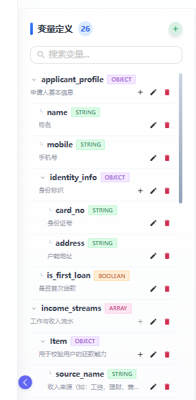
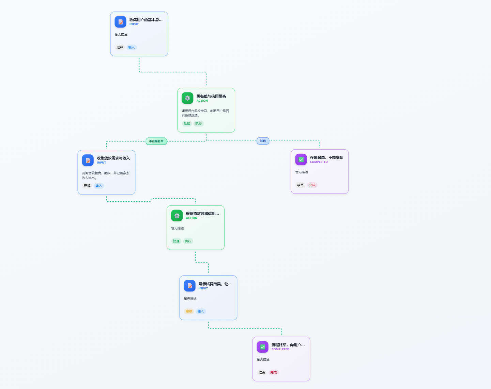

# J-Parlant
## 🚀 让 AI Agent 告别“黑盒”运行

### **专为Java开发者打造稳定、可控、业务驱动的企业级 AI Agent 开发平台**

#### 长期以来，AI 领域被 Python 生态主导，Java 开发者在构建生产级 Agent 时常面临“框架缺失、工程底座薄弱、Python 集成成本高”的尴尬，且需要面对大模型在复杂业务场景下不可控的痛点。J-Parlant 致力于打破这一僵局，让 Java 开发者能够利用熟悉的工程思维，通过可视化拖拽编排与原生 Java 业务代码的深度耦合，从而构建出在复杂业务场景下依然表现稳定、高度受控的Agent。

## 💡 为什么需要 J-Parlant？

在构建生产级 Agent 时，纯粹的 Prompt 工程往往难以应对复杂的业务：

- **行为不可控**：LLM 容易脱离业务范畴“胡言乱语”，难以保证回复的专业性与合规性。
- **逻辑碎片化**：业务流程散落在大量的 Prompt 模板中，难以维护和审计。
- **缺乏长任务引导能力**: 传统模式局限于被动响应的“一问一答”，难以维持复杂的任务状态机，无法主动引导用户完成长链路的业务场景。
- **执行链路难闭环**：LLM 工具调用具备随机性，常因幻觉或参数缺失调用失败，导致无法完成业务。
- **高并发工程门槛高**：受限于 AI 推理天然的“长耗时”特性，开发者在应对海量并发时，被迫需要处理复杂的异步流控、线程隔离与非阻塞响应式逻辑，学习成本大。

**J-Parlant 正是为解决这些痛点而生。它通过“可视化逻辑编排 + 原子化业务代码”的低代码模式，将不可控的行为、碎片化的逻辑与高并发门槛一站式化解，让 AI Agent 像传统软件一样稳定运行。**

## 📦 项目组成

J-Parlant 采用 **“编排与运行分离”** 的架构，逻辑编排在独立工作台中完成定义，而执行过程则深度集成于业务宿主项目中。这种设计确保了 AI 逻辑的跨项目复用与极简集成，其核心组件包括：

*   **[J-Parlant Admin](https://gitee.com/sylvara/jparlant-admin)** （本项目）：可视化管理后台，负责 Agent 的创建、意图定义、流程编排与对话测试。
*   **[J-Parlant Server](https://gitee.com/sylvara/jparlant-backend)**：Admin配套后端服务，承担Agent元数据的持久化存储。
*   **[J-Parlant Starter](https://gitee.com/sylvara/j-parlant)**：**Agent工作引擎**。当你在 Admin 中完成流程编排后，需在具体的 Spring Boot 业务项目中引入此 Starter，即可通过 API 轻松调用已编排好的 Agent。


## 🚀 核心理念与能力

### 可视化、低代码流程编排

通过拖拽方式设计 Agent 流程，支持：
- 条件分支：根据用户输入走不同的流程路径
- 流程变量：在节点间传递和处理数据
- 业务动作：调用后端服务执行业务逻辑

### 全链路合规与审计

统一管理内容审核和合规检查规则：
- 支持关键词、正则表达式、SpEL 表达式、AI 智能审核等多种匹配方式
- 可分别配置输入检查和输出检查
- 自定义拦截时的提示语和引导话术

### 术语库管理

建立统一的业务术语库，提升 AI 理解准确性：
- 定义专业术语及其解释
- 配置同义词和相关术语
- 提供使用示例帮助 AI 更好理解

### 对话测试

内置对话测试功能，实时验证配置效果：
- 支持文本和图片输入
- 流式展示 AI 回复
- 快速定位配置问题


## 快速开始

### 快速集成体验

> **想跳过编排，直接看效果？** 我们内置了一个贷款助手Agent，只需简单三步即可体验。

#### 1. 基础环境准备
- **初始化数据库**：执行项目根目录下的 `docs/sql/init.sql` 脚本。
- **配置 Mysql，Redis 和 AI 模型**：
```yaml
spring:
  r2dbc:
    url: r2dbc:mysql://localhost:3306/jd?useSSL=false&serverTimezone=UTC
    username: your_username
    password: your_password
    pool:
      enabled: true
      initial-size: 10
      max-size: 50
      max-idle-time: 30m
      validation-query: SELECT 1
  data:
    redis:
      host: localhost
      port: 6379
      username: your_redis_user  # 无认证可删除此行
      password: your_redis_pass  # 无认证可删除此行
  ai:
    openai:
      api-key: ${OPENAI_API_KEY}
      base-url: ${OPENAI_API_URL}
      chat:
        options:
          model: moonshot-v1-8k
          temperature: 0.2
          frequencyPenalty: 1.0
          maxCompletionTokens: 1024
          presencePenalty: 0.5
```

#### 2. 引入核心依赖
在业务项目的 `pom.xml` 中添加 J-Parlant 官方 Starter：
```xml
<dependency>
    <groupId>io.gitee.sylvara</groupId>
    <artifactId>jparlant-spring-boot-starter</artifactId>
    <version>1.0.1.RELEASE</version>
</dependency>
```

#### 3. 调用 API 开启业务测试
```java

import com.jparlant.service.chat.JParlantChatService;
import org.springframework.beans.factory.annotation.Autowired;
import com.jparlant.model.ChatRequest;

@Autowired
private JParlantChatService chatService;

// 非流式
chatService.chat(ChatRequest chatRequest);

// 流式（打字机效果）
chatService.stream(ChatRequest chatRequest);
```

---


### 🛠️ 进阶：搭建可视化控制台编排自定义的Agent


### 环境要求

- Node.js 16+
- 启动后端服务 **[J-Parlant Server](https://gitee.com/sylvara/jparlant-backend)**

### 安装和运行

```bash
# 克隆项目
git clone https://gitee.com/sylvara/jparlant-admin.git

# 配置后端地址
在 `vite.config.ts` 中修改 J-Parlant Server 服务地址：

proxy: {
  '/api': {
    target: 'http://localhost:9085',  // 修改为J-Parlant Server后端地址
    changeOrigin: true
  }
}

# 安装依赖
cd jparlant-admin
npm install

# 启动开发服务器
npm run 

启动后访问 http://localhost:3000 即可使用。
```


## 使用指南

### 🤖 第一步：创建 Agent

1. 进入 Agent 管理页面
2. 点击「新建 Agent」
3. 填写 Agent 名称和系统指令
4. 保存后即可开始配置

### 🎯 第二步：配置意图

1. 进入 Agent 的意图管理页面
2. 创建一个新意图，如「查询订单」
3. 保存意图配置

### 🔗 第三步：编排流程

1. 点击意图卡片上的「流程编排」按钮
2. 在画布上添加流程节点
3. 配置每个节点的详细参数：
   - 设置节点名称和提示语
   - 配置输入验证规则
   - 绑定业务动作
4. 连接节点形成完整流程
5. 保存流程配置


### ✅ 第四步：测试验证(可选，也可用postman、 apifox测试)

在 `vite.config.ts` 中修改对话业务服务地址。**注意：此地址必须指向集成了 **[J-Parlant Starter](https://gitee.com/sylvara/j-parlant)** 的业务后端，否则无法进行对话测试。**

```typescript
proxy: {
  '/customerAgent': { // 修改为你的业务对话服务url
    target: 'http://localhost:9085',  // 修改为你的业务对话服务地址
    changeOrigin: true
  }
}
```
**注意：** 需要通过@RequestHeader("userId") String userId在业务服务接口中接受userId参数。

1. 进入意图的对话测试页面
2. 输入测试问题
3. 观察 AI 回复是否符合预期
4. 根据测试结果调整流程配置


## 项目截图

### 支持复杂的变量定义



### 流程编排


### 贷款助手Agent测试


## 贡献指南

欢迎提交 Issue 和 Pull Request！

- 提交 Issue 前请先搜索是否已有类似问题
- Pull Request 请确保代码通过类型检查
- 新功能请附带相应的说明文档

## 开源协议

[Apache License 2.0](LICENSE)

---

🎯 **J-Parlant：赋予 AI 确定性的业务灵魂。**
